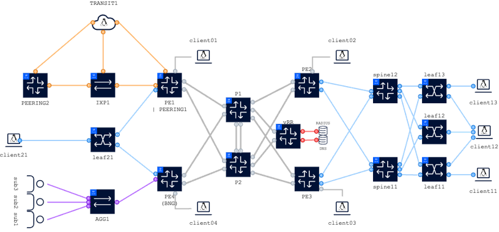

# Configuring a L2 DCI service on SR Linux and SR OS

| Item | Details |
| --- | --- |
| Short Description | Learn how to stretch a broadcast domain between two datacenters using EVPN-MPLS Interconnect for EVPN-VXLAN VPLS Services. |
| Skill Level | Intermediate |
| Tools Used | SR OS, EVPN, SR Linux |

## Objective

In this lab, you will configure a L2 DCI or L2 Datacenter Interconnect EVPN service between two leafs as depicted in the SROS user guide chapter [EVPN-MPLS Interconnect for EVPN-VXLAN VPLS Services](https://documentation.nokia.com/acg/24-7-2/books/layer-2-services-evpn-md/m1127-evpn-dci-md-cli.html#undefined) .

In the diagram below you will see two datacenters which are interconnected with a WAN. 



You will perform necessary pre-checks to understand whether or not the underlay and overlay are ready, add the configuration for your service and verify it functions correctly.

The EVPN DCI service will be configured between `leaf11` and `leaf21`, intending to provide L2 connectivity between `client11` and `client21`.

The VxLAN to MPLS stitching is done on node `pe1` for `leaf21` and on node `pe2` for `leaf11`. In production networks, the DCGWs are redundant pairs but having such design requires implementing specific routing policies to prevent loops for L2 interconnect cases. For sake of simplicity we've chosen a non-redundant solution.


## Accessing the lab
In this lab you will interact with the model-driven SR OS nodes `pe1`, `pe2`, as well as  the SR Linux nodes `leaf11` and `leaf21`. Lastly, you will need the client devices `client11` and `client21`. Commands to access these nodes are
```
ssh -l admin clab-srexperts-pe1
ssh -l admin clab-srexperts-pe2
#
ssh -l admin clab-srexperts-leaf11
ssh -l admin clab-srexperts-leaf21
#
ssh -l user clab-srexperts-client11
ssh -l user clab-srexperts-client21
```

## Task 1: Confirm the underlay for both datacenters is functional and ready
In each datacenter the leaf node needs to have a way to reach the edge of the datacenter, also known as the DCGW. In both datacenters in this topology, eBGP fulfills the role of underlay transport protocol that is used to route VxLAN encapsulated packets.

Confirm that the underlay network is set up correctly, and the leafs have reachability to the DCGWs and the `vRR` node being used to exchange service routes. In a production network the spines are usually selected as the route-reflectors, but in this case vRR is going to serve as RR.

The datapath will look like this:

**client21** <*dot1q*> **leaf21** <*vxlan*> **PE1** <*mpls*> **P1&P2** <*mpls*> **PE2** <*vxlan*> **Spine11&Spine12** <*vxlan*> **leaf11** <*dot1q*> **client11**


**Check the status of BGP neighbors**

```
# For SRLinux
/show network-instance default protocols bgp neighbor
```

```
# For SROS
/show router bgp summary
```
**Check whether the routing tables have the system IP of VxLAN tunnel endpoints. (Leaf and PE)**

**What is the next hop address that leaf11 follows to go to PE2 and vice versa?**

**What is the next hop address that leaf21 follows to go to PE1 and vice versa?**

```
# For SRLinux
/show network-instance default route-table
```

```
# For SROS IPv4
/show router route-table ipv4
```
```
# For SROS IPv6
/show router route-table ipv6
```

## Task 2: Confirm the overlay for both datacenters is functional and ready
iBGP EVPN family is used to exchange overlay routes. The underlay facilitates this connectivity between the loopbacks of EVPN speakers. For this topology, each leaf peers with the `vRR` node. In production environments, the leaf would be peering with the spines or DCGW instead. Verify that this peering is setup and functional, verify the address-family of the peering and record the amount of routes being exchanged.

Note: vRR system IP is fd00:fde8::3:13

<details>
<summary>Solution</summary>

For SRLinux
```
show network-instance default protocols bgp neighbor
```

For SROS
```
show router bgp summary
```
</details>

## Task 3: Confirm the DCGWs are ready in both datacenters
The `vRR` is expected to be exchanging routes with both the DCGW nodes and the leafs. In the last step, we verified the latter, now access the two PE nodes and confirm the EVPN peering with vRR is in an good shape. Once again, record the address-families in use as well as the number of routes being exchanged.

Note: vRR system IP is fd00:fde8::3:13

<details>
<summary>Solution</summary>
```
show router bgp summary
```
</details>

## Task 4: Configure the service on the SR Linux leafs


<details>
<summary>Solution for leaf11</summary>

```
/ 
enter candidate

#Configure the client facing subinterface with vlan 1000
set / interface ethernet-1/1 subinterface 1000 type bridged
set / interface ethernet-1/1 subinterface 1000 vlan encap single-tagged vlan-id 1000

#Configure the vxlan tunnel
set / tunnel-interface vxlan0 vxlan-interface 1000 type bridged
set / tunnel-interface vxlan0 vxlan-interface 1000 ingress vni 1000

#Create the L2 EVPN instance and attach physical and vxlan interfaces
set / network-instance l2dci type mac-vrf
set / network-instance l2dci admin-state enable
set / network-instance l2dci interface ethernet-1/1.1000
set / network-instance l2dci vxlan-interface vxlan0.1000
set / network-instance l2dci protocols bgp-evpn bgp-instance 1 admin-state enable
set / network-instance l2dci protocols bgp-evpn bgp-instance 1 vxlan-interface vxlan0.1000
set / network-instance l2dci protocols bgp-evpn bgp-instance 1 evi 99
set / network-instance l2dci protocols bgp-vpn bgp-instance 1 route-target export-rt target:1:1000
set / network-instance l2dci protocols bgp-vpn bgp-instance 1 route-target import-rt target:1:1000

commit now
```

</details>

<details>
<summary>Solution for leaf21</summary>

```
/ 
enter candidate

#Configure the client facing subinterface with vlan 1000
set / interface ethernet-1/1 subinterface 1000 type bridged
set / interface ethernet-1/1 subinterface 1000 vlan encap single-tagged vlan-id 1000

#Configure the vxlan tunnel
set / tunnel-interface vxlan0 vxlan-interface 2000 type bridged
set / tunnel-interface vxlan0 vxlan-interface 2000 ingress vni 2000

#Create the L2 EVPN instance and attach physical and vxlan interfaces
set / network-instance l2dci type mac-vrf
set / network-instance l2dci admin-state enable
set / network-instance l2dci interface ethernet-1/1.1000
set / network-instance l2dci vxlan-interface vxlan0.2000
set / network-instance l2dci protocols bgp-evpn bgp-instance 1 admin-state enable
set / network-instance l2dci protocols bgp-evpn bgp-instance 1 vxlan-interface vxlan0.2000
set / network-instance l2dci protocols bgp-evpn bgp-instance 1 evi 99
set / network-instance l2dci protocols bgp-vpn bgp-instance 1 route-target export-rt target:2:1000
set / network-instance l2dci protocols bgp-vpn bgp-instance 1 route-target import-rt target:2:1000

commit now
```

</details>

## Task 5: Configure the service on the SROS PE/DCGW nodes that will stitch VXLAN and MPLS tunnels
TODO / Placeholder: Configure the service on SR OS

<details>
<summary>Solution for PE1</summary>

```
exit all
configure global

#Create the service that will stitch VxLAN to MPLS
/configure service vpls "l2dci" admin-state enable
/configure service vpls "l2dci" service-id 99
/configure service vpls "l2dci" customer "1"

#Attach the VxLAN interface
/configure service vpls "l2dci" vxlan instance 1 vni 2000

# First instance of BGP will serve to the VXLAN domain hence RT has to match the RT set on the Leaf
/configure service vpls "l2dci" bgp 1 route-distinguisher auto-rd
/configure service vpls "l2dci" bgp 1 route-target export "target:2:1000"
/configure service vpls "l2dci" bgp 1 route-target import "target:2:1000"

# Second instance of BGP will serve to the MPLS domain, hence RT has to match the RT of the remote DCGW.
/configure service vpls "l2dci" bgp 2 route-distinguisher auto-rd
/configure service vpls "l2dci" bgp 2 route-target export "target:99:99"
/configure service vpls "l2dci" bgp 2 route-target import "target:99:99"

/configure service vpls "l2dci" bgp-evpn evi 99

# Tunnel binding for VXLAN domain
/configure service vpls "l2dci" bgp-evpn vxlan 1 admin-state enable
/configure service vpls "l2dci" bgp-evpn vxlan 1 vxlan-instance 1

# Tunnel binding for MPLS domain
/configure service vpls "l2dci" bgp-evpn mpls 2 admin-state enable
/configure service vpls "l2dci" bgp-evpn mpls 2 auto-bind-tunnel resolution any

commit

```

</details>


<details>
<summary>Solution for PE2</summary>

```
exit all
configure global

#Create the service that will stitch VxLAN to MPLS
/configure service vpls "l2dci" admin-state enable
/configure service vpls "l2dci" service-id 99
/configure service vpls "l2dci" customer "1"

#Attach the VxLAN interface
/configure service vpls "l2dci" vxlan instance 1 vni 1000

# First instance of BGP will serve to the VXLAN domain hence RT has to match the RT set on the Leaf
/configure service vpls "l2dci" bgp 1 route-distinguisher auto-rd
/configure service vpls "l2dci" bgp 1 route-target export "target:1:1000"
/configure service vpls "l2dci" bgp 1 route-target import "target:1:1000"

# Second instance of BGP will serve to the MPLS domain, hence RT has to match the RT of the remote DCGW.
/configure service vpls "l2dci" bgp 2 route-distinguisher auto-rd
/configure service vpls "l2dci" bgp 2 route-target export "target:99:99"
/configure service vpls "l2dci" bgp 2 route-target import "target:99:99"

/configure service vpls "l2dci" bgp-evpn evi 99

# Tunnel binding for VXLAN domain
/configure service vpls "l2dci" bgp-evpn vxlan 1 admin-state enable
/configure service vpls "l2dci" bgp-evpn vxlan 1 vxlan-instance 1

# Tunnel binding for MPLS domain
/configure service vpls "l2dci" bgp-evpn mpls 2 admin-state enable
/configure service vpls "l2dci" bgp-evpn mpls 2 auto-bind-tunnel resolution any

commit
```

</details>


## Task 6: Test your service by exchanging traffic between the client devices
By re-using the commands from the earlier tasks in this usecase, you should observe that additional routes are being exchanged in the various BGP sessions. How many additional routes do you see? In which peerings specifically? Is that in line with your expectation?

If the services set up correctly and the necessary routes are being exchanged, sending traffic between the clients should now be possible. The tried and true method for verifying such matters is still ping. Thus, issue a ping command on either of the clients and confirm it can reach and receive responses from the other client through your service.

*Using any method you can think of, can you confirm the path the traffic takes through the network?*

<details>
<summary>Solution</summary>

```
for SRLinux
/show network-instance default protocols bgp neighbor
for SROS
/show router bgp summary

for SRLinux
/show network-instance default route-table
for SROS
/show router route-table ipv4
/show router route-table ipv6
```
</details>

*What is the next hop address that `leaf11` follows to go to PE2?*


